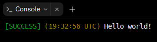

# coloured-logs
This package makes your console logs shine! It also adds the time of log too.



## Installation
NPM installation:
```console
$ npm install coloured-logs
```
Package usage:
```js
const cons = require("coloured-logs");
```

## Available log functions
```js
cons.success("Message sent!");
cons.info("Request received!");
cons.error("Could not process file");
cons.response("Request returned status 200");
cons.server("Server listening on port 3000");
```

## Configuration/customisation
You can optionally turn on/off the timestamp in every log. Timestamp is on by default.
```js
cons.setConfig({
  timestamp: false
});
```
It will then apply for all logs executed after the `setConfig()` function.

## Author
This package was made by [SnakeByte](https://replit.com/@SnakeByte), a proud user of [Replit](https://replit.com).

## License and Usage
This package is licensed under the [MIT License](https://github.com/TheSnakeByte/coloured-logs/blob/main/LICENSE).

## Feedback
If you encounter any issues, have questions, or need support, feel free to reach out to the package maintainer or open an issue on the project repository.
